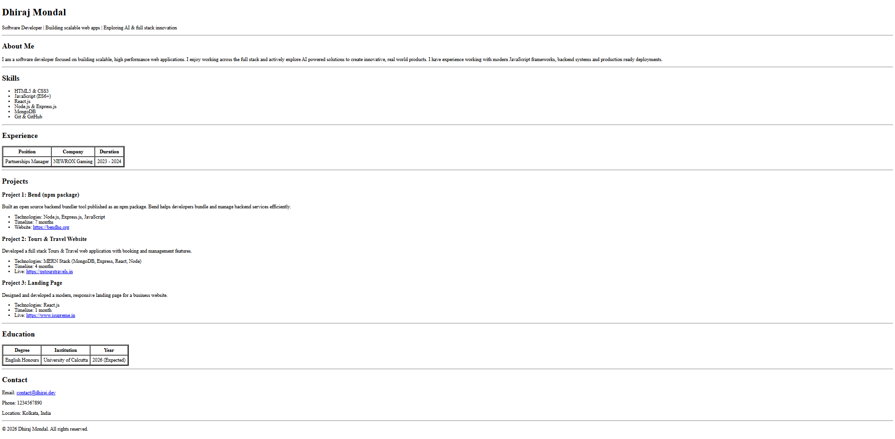
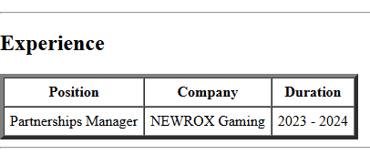
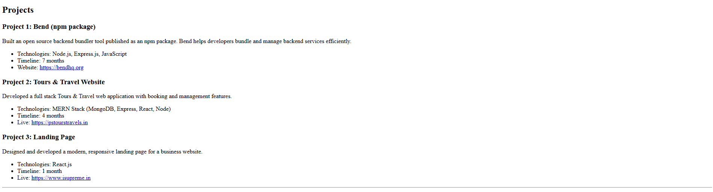
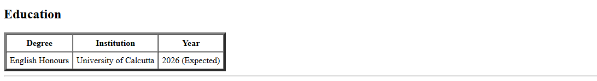
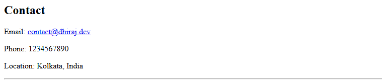

# Resume Website

This project is a single page resume website built using pure HTML. The goal of this assignment is to recreate a provided resume layout using proper HTML structure, tables, lists and semantic elements while maintaining clean spacing, alignment and readability.

The project demonstrates understanding of core HTML concepts including headings, paragraphs, lists, tables, hyperlinks and basic document structure.

---

## Project Overview

* Single page resume website
* Built with only HTML (no external frameworks)
* Uses tables for structured data (Experience & Education)
* Uses lists for Skills and Project details
* Includes working external links
* Clean layout matching the provided reference image

---

## Folder Structure

```
resume/
├── screenshots/
├── index.html
└── README.md
```

---

## Setup Instructions

Follow these steps to run the project locally:

1. Download or clone the repository:

   ```bash
   git clone https://github.com/dhirajdotdev/resume
   ```

2. Open the project folder:

   ```bash
   cd resume
   ```

3. Open the resume in a browser:

   * Double click `index.html`
   * OR right click → Open with → Chrome / Edge / Firefox

No additional setup or dependencies are required.

---


## Screenshots


### Suggested Screenshots


```
screenshots/
├── full-page.png
├── experience-section.png
├── projects-section.png
└── education-section.png
└── contact-section.png
```









---

## Evaluation Criteria Mapping

| Requirement                    | Implementation                                   |
| ------------------------------ | ------------------------------------------------ |
| UI layout and structure        | Proper headings, HR separators and section flow |
| Spacing and alignment          | Tables, lists and horizontal rules              |
| Visual clarity and readability | Clean HTML hierarchy and formatting              |
| Proper use of HTML semantics   | Headings, tables, lists, paragraphs              |
| Overall user experience        | Simple, readable and professional layout        |
| Working external links         | All project and email links are clickable        |

---

## Author

**Dhiraj Mondal**
Software Developer | Full-Stack & AI Exploration
Location: Kolkata, India
Email: [contact@dhiraj.dev](mailto:contact@dhiraj.dev)